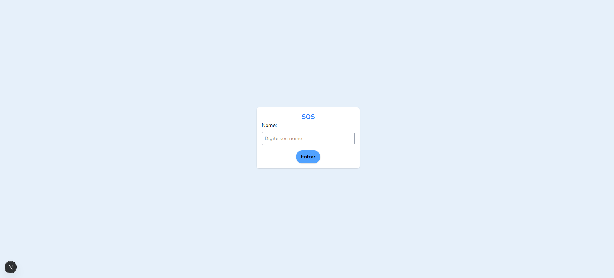
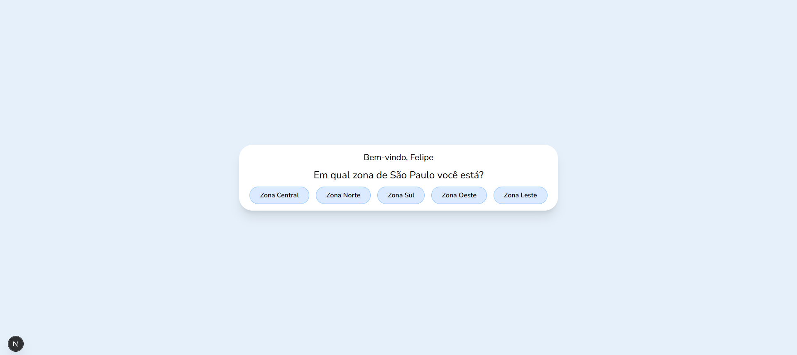
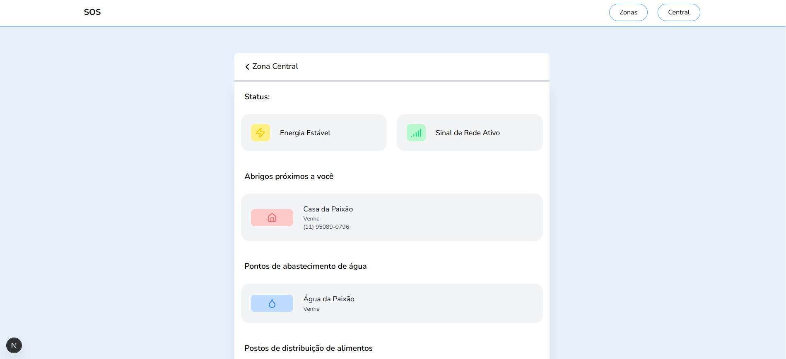

# SOS zonas

## Integrantes

### 1TDSPR
|  |
|-------------------------------------------|
| 
Felipe Soares Gonçalves
|
| 
RM: 559175
|
| 
[GitHub](https://github.com/fiapfelipe)
|
| 
[Linkedin](https://www.linkedin.com/in/felipe-soares-40bb0125b/)
|

|  |
|-------------------------------------------|
| 
Henrique Batista de Souza
|
| 
RM: 99742
 |
| 
[GitHub](https://github.com/rickfiap)
|
| 
[Linkedin](https://www.linkedin.com/in/henriquebatistadev/)
|

|  |
|-------------------------------------------|
| 
Julia Lima Rodrigues
|
| 
RM: 559781
 |
| 
[GitHub](https://github.com/juliafiap)
|
| 
[Linkedin](http://www.linkedin.com/in/julia-rodrigues-a12a3924b)
|

## Descrição do Projeto
O SOS Zonas é um painel interativo e responsivo, projetado para apoiar comunidades e órgãos públicos durante situações de desastres naturais e emergências climáticas.
A solução oferece um mapa dinâmico da cidade com informações atualizadas em tempo real sobre abrigos, disponibilidade de água potável, pontos sem energia, status do sinal de celular e outros recursos essenciais.
Além disso, o sistema permite a simulação de cenários de risco, treinamento da população e atuação em modo "Central de Comando" para agentes da Defesa Civil.

## Conheça o Projeto 
<a href='https://global-solution-gules.vercel.app/'>SOS zonas Projeto</a>

## Link API
<a href='https://api-java-gs-production.up.railway.app/'>API SOS zonas</a>

Ao consultar os endpoints, colocar no plural. Exemplo: /abrigos, /comidas e etc.

## Repositório API 
<a href='https://github.com/CyPHER298/api-java-gs'>Repositório: API SOS zonas</a>

## Vídeo apresentando projeto 
<a href='https://youtu.be/IDFTqfmSWy0?si=hPfBGZJVq8LI5vf-'>SOS zonas Apresentação</a>

## Estrutura do Projeto
Aqui estão as seções principais da nossa apresentação. As imagens abaixo representam telas e fluxos da aplicação.

|        |        |
|-------------------------------------------|---------------------------------------------|
| 
Tela de Login
       | 
Tela de Inicio
      |

|     |    |
|-------------------------------------------|---------------------------------------------|
| 
Tela de Zona
 | 
Tela de Mensagem
 |

|    |           |
|-------------------------------------------|---------------------------------------------|
| 
Tela de Confirmação
   | 
Tela Responsiva
       |

## Tecnologias Utilizadas

  
  
  
  
  

